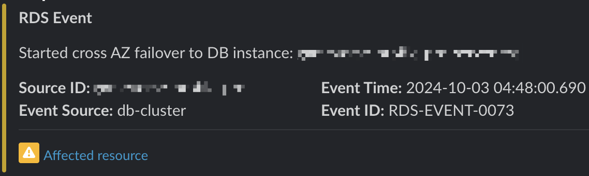
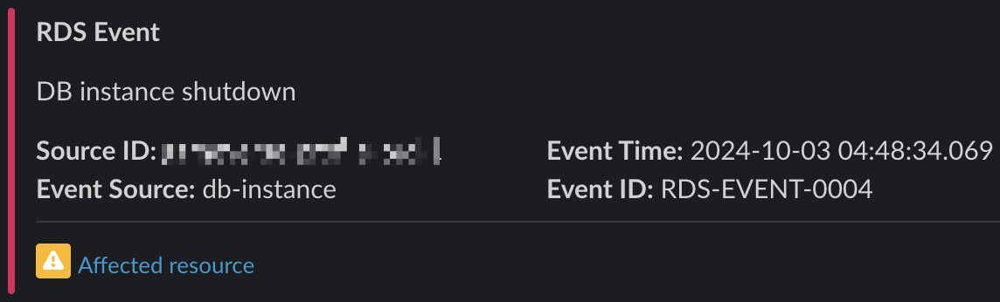
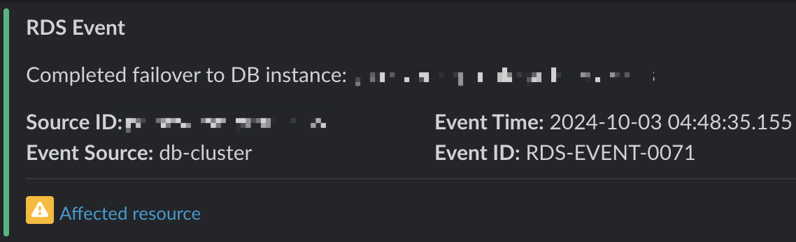

# AWS RDS Event Notification Module

This Terraform module configures [Amazon RDS event notifications](https://docs.aws.amazon.com/AmazonRDS/latest/UserGuide/USER_Events.html) and forwards them to a Slack channel through a webhook URL. It helps you stay informed about important RDS events for both database instances and clusters.

## Features

- Monitors RDS instance and cluster events
- Sends notifications to Slack via webhook
- Configurable event categories for both instances and clusters
- Supports multiple RDS instances and clusters
- Uses AWS SNS for reliable message delivery

## Usage

```hcl
module "rds_notifications" {
  source = "devsecops-studio/rds-event-notification/aws"

  name          = "rds-notifications"
  slack_webhook = var.slack_webhook_url
  
  # RDS instances to monitor
  db_instance_ids = ["db-instance-1", "db-instance-2"]
  
  # RDS clusters to monitor
  db_cluster_ids  = ["db-cluster-1"]
  
  tags = {
    Environment = "production"
    Terraform   = "true"
  }
}
```

## Notification screenshot

- DB instance failover


- DB instance failover


- DB instance failover completed


<!-- BEGIN_TF_DOCS -->
## Requirements

| Name | Version |
|------|---------|
| <a name="requirement_terraform"></a> [terraform](#requirement\_terraform) | >= 1.0 |
| <a name="requirement_aws"></a> [aws](#requirement\_aws) | >= 5.55 |

## Providers

| Name | Version |
|------|---------|
| <a name="provider_aws"></a> [aws](#provider\_aws) | >= 5.55 |

## Modules

| Name | Source | Version |
|------|--------|---------|
| <a name="module_slack_notifier_function"></a> [slack\_notifier\_function](#module\_slack\_notifier\_function) | terraform-aws-modules/lambda/aws | 7.7.1 |

## Resources

| Name | Type |
|------|------|
| [aws_db_event_subscription.db_cluster](https://registry.terraform.io/providers/hashicorp/aws/latest/docs/resources/db_event_subscription) | resource |
| [aws_db_event_subscription.instances](https://registry.terraform.io/providers/hashicorp/aws/latest/docs/resources/db_event_subscription) | resource |
| [aws_sns_topic.this](https://registry.terraform.io/providers/hashicorp/aws/latest/docs/resources/sns_topic) | resource |
| [aws_sns_topic_subscription.slack_notifier_function](https://registry.terraform.io/providers/hashicorp/aws/latest/docs/resources/sns_topic_subscription) | resource |

## Inputs

| Name | Description | Type | Default | Required |
|------|-------------|------|---------|:--------:|
| <a name="input_create"></a> [create](#input\_create) | wheter or not to create resources | `bool` | `true` | no |
| <a name="input_db_cluster_event_categories"></a> [db\_cluster\_event\_categories](#input\_db\_cluster\_event\_categories) | List of event categories for RDS cluster instances | `list(string)` | <pre>[<br/>  "configuration change",<br/>  "failover",<br/>  "failure",<br/>  "maintenance"<br/>]</pre> | no |
| <a name="input_db_cluster_ids"></a> [db\_cluster\_ids](#input\_db\_cluster\_ids) | List of RDS cluster instances to monitor | `list(string)` | `[]` | no |
| <a name="input_db_instance_event_categories"></a> [db\_instance\_event\_categories](#input\_db\_instance\_event\_categories) | List of event categories for RDS instances | `list(string)` | <pre>[<br/>  "availability",<br/>  "configuration change",<br/>  "failover",<br/>  "failure",<br/>  "low storage",<br/>  "maintenance"<br/>]</pre> | no |
| <a name="input_db_instance_ids"></a> [db\_instance\_ids](#input\_db\_instance\_ids) | List of RDS instances to monitor | `list(string)` | `[]` | no |
| <a name="input_name"></a> [name](#input\_name) | Name to apply for created resources | `string` | n/a | yes |
| <a name="input_slack_webhook"></a> [slack\_webhook](#input\_slack\_webhook) | Slack webhook URL | `string` | n/a | yes |
| <a name="input_tags"></a> [tags](#input\_tags) | n/a | `map(string)` | `{}` | no |

## Outputs

| Name | Description |
|------|-------------|
| <a name="output_sns_topic_arn"></a> [sns\_topic\_arn](#output\_sns\_topic\_arn) | n/a |
<!-- END_TF_DOCS -->
